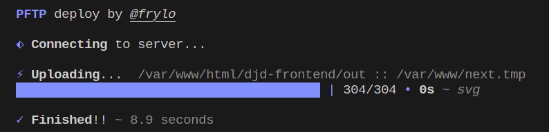
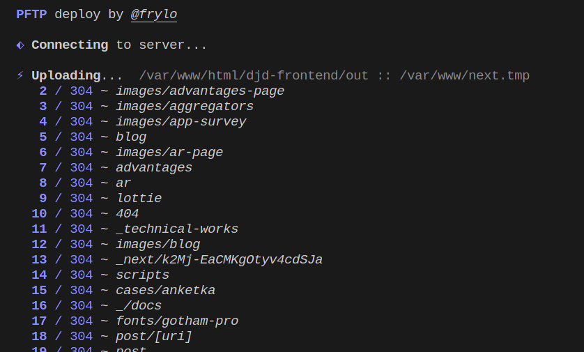

# 🚀 @frylo/pftp - Progressive FTP

This package using [LFTP](https://lftp.yar.ru/) to deploy your code to FTP/SFTP/SSH server.

➕ **Benefits**

```md
1. **Fast**
   1. Updates only changed files.
   2. Deploy faster with parallel deployment processes.
   3. Deploy of 1GB project took about 10 seconds.
2. **Clear**
   1. Only necessary info in you console.
   2. See the process of deployment with progressbar.
3. **Simple**
   1. Only integral options.
   2. Autocompletion for configuration.
   3. Advanced configuration is also available, but hidden deeper in config.
```

🔗 **Reference**

- [🎁 Examples](#-examples)
  - [👁️ Progressbar CLI example](#️-progressbar-cli-example)
  - [👁️ Progress logs CLI example](#️-progress-logs-cli-example)
- [🏁 Getting Started](#-getting-started)
- [🔑 Configuration](#-configuration)
- [⚙️ Package development](#️-package-development)

## 🎁 Examples

### 👁️ Progressbar CLI example

<details><summary>Code of example</summary>

```js
const process = require("process");
const { deploy } = require("../lib/index.js");
const { credentials, folders } = require("./credentials.js");

async function main() {
  await deploy({
    host: "000.00.00.0",
    port: 22,
    protocol: "sftp",
    username: "my-username",
    password: "my-password",

    progress: "bar", // << This option change the view

    localFolder: "./build",
    remoteFolder: "/var/www/my-site.com",
  });
}

main()
  .then(() => process.exit())
  .catch((error) => console.error(error));
```

</details>



### 👁️ Progress logs CLI example

<details><summary>Code of example</summary>

```js
const process = require("process");
const { deploy } = require("../lib/index.js");
const { credentials, folders } = require("./credentials.js");

async function main() {
  await deploy({
    host: "000.00.00.0",
    port: 22,
    protocol: "sftp",
    username: "my-username",
    password: "my-password",

    progress: "logs", // << This option change the view

    localFolder: "./build",
    remoteFolder: "/var/www/my-site.com",
  });
}

main()
  .then(() => process.exit())
  .catch((error) => console.error(error));
```

</details>



## 🏁 Getting Started

Install package:

```zsh
npm install --save-dev @frylo/pftp
yarn install -D @frylo/pftp
pnpm i -D @frylo/pftp
```

Create upload script file, e.g. `deployment.mjs`:

```js
import { deploy, Credentials } from "@frylo/pftp";

/** @type {Credentials} */
const credentials = {
  host: "000.00.00.0",
  port: 22,
  protocol: "sftp",
  username: "my-username",
  password: "my-password",
};

async function main() {
  await deploy({
    ...credentials,
    localFolder: "./build",
    remoteFolder: "/var/www/my-site.com",
    progress: "bar",
  });
}

main.then(() => process.exit());
```

Run upload script to deploy files:

```bash
node ./deployment.mjs
```

## 🔑 Configuration

**Configuration** schema:

| Option             | Value             | Description                                                                                                                                                                                                                                                                                                                                                                                                                                                              |
| ------------------ | ----------------- | ------------------------------------------------------------------------------------------------------------------------------------------------------------------------------------------------------------------------------------------------------------------------------------------------------------------------------------------------------------------------------------------------------------------------------------------------------------------------ |
| host               | string            | IP or URL of your host.                                                                                                                                                                                                                                                                                                                                                                                                                                                  |
| port               | number            | Number of port, usually 21 for FTP and 22 for SFTP.                                                                                                                                                                                                                                                                                                                                                                                                                      |
| protocol           | 'ftp', 'sftp'     | Protocol for upload. If you are using SSH server, you could simply use SFTP with 22 port.                                                                                                                                                                                                                                                                                                                                                                                |
| username           | string            | Username for connection.                                                                                                                                                                                                                                                                                                                                                                                                                                                 |
| password           | string            | Password for connection.                                                                                                                                                                                                                                                                                                                                                                                                                                                 |
| localFolder        | string            | Path to source folder on local machine.                                                                                                                                                                                                                                                                                                                                                                                                                                  |
| remoteFolder       | string            | Path to target folder on remote machine.                                                                                                                                                                                                                                                                                                                                                                                                                                 |
| excludeRegExp      | RegExp[]          | List of RegExp's to be excluded. Given RegExp's are applied to file and dir names which are in realtive form (relative to cwd). All RegExp's have to be in [Egrep](https://www.gnu.org/software/findutils/manual/html_node/find_html/posix_002degrep-regular-expression-syntax.html) format, so **flags are not allowed** and there are some **small difference between JS RegExp and Egrep**.                                                                   |
| includeForceRegExp | RegExp[]          | Files matching any of this regexp will be uploaded to server no matter has been it changed or not. Given RegExp's are applied to file and dir names which are in realtive form (relative to cwd). All RegExp's have to be in [Egrep](https://www.gnu.org/software/findutils/manual/html_node/find_html/posix_002degrep-regular-expression-syntax.html) format, so **flags are not allowed** and there are some **small difference between JS RegExp and Egrep**. |
| progress           | 'bar', 'logs'     | Customize process loggin.<br />\* Bar - show progress bar (useful for manual execution);<br />\* Logs - print logs (useful for GitLab CI/CD).                                                                                                                                                                                                                                                                                                                            |
| customLftpOptions  | CustomLftpOptions | Allows to advancely configure LFTP. Usually you don't need this option. Read more about this options in CustomLftpOptions schema section.                                                                                                                                                                                                                                                                                                                                |

**CustomLftpOptions** schema:

| Option                    | Value   | Description                                                                                                                                                                                                                                                    |
| ------------------------- | ------- | -------------------------------------------------------------------------------------------------------------------------------------------------------------------------------------------------------------------------------------------------------------- |
| lftpCommand               | string  | Path to LFTP executable or name of lftp command. Defaults to "lftp".                                                                                                                                                                                           |
| logLftpCommand            | boolean | If true script will log generated LFTP command to console.                                                                                                                                                                                                     |
| beforeOpen                | string  | In this string you can pass command to lftp that will be ran before "open" command (before connection).<br />**Default value**: `set net:timeout 5; set net:max-retries 3; set net:reconnect-interval-multiplier 1; set net:reconnect-interval-base 5` |
| openCommandOptions        | string  | Here you can rewrite CLI options for [open LFTP command](https://lftp.yar.ru/lftp-man.html).                                                                                                                                                                       |
| beforeMirror              | string  | In this string you can pass command to LFTP that will be ran before "mirror" command (then you connected, but mirroring haven't started yet).                                                                                                                  |
| mirrorCommandOptions      | string  | Here you can rewrire CLI options for mirror LFTP command.<br />**Default value**: `--reverse --delete --only-newer --verbose=2 --ignore-time --parallel=10`                                                                                            |
| beforeMirrorForce         | string  | In this string you can pass command to lftp that will be ran before second "mirror" command that uploads files by force (check includeForceRegExp config options for more info).                                                                               |
| mirrorForceCommandOptions | string  | Options for mirror command, that runs at second phase if `importForceRegExp` option is present.<br />**Default value**: `--reverse --verbose=2 --parallel=10`                                                                                             |
| enaleSsl                  | string  | By default SSL option for LFTP is disabled, because usually it bring pain for beginners. You could enable it back with this option.                                                                                                                            |

## ⚙️ Package development

Read more about package development [here](./readme/package-development.md).
